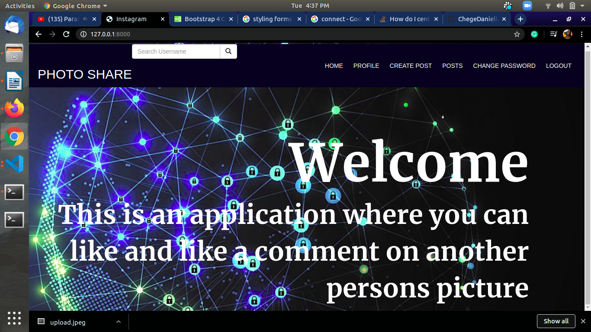

# Photo Share

This application is to be used by users where they can be able to login and like images shared by other people and see more details on the photos.
The user can also post there own photos and they will see the likes they get and can also add details on the photo.

## Getting started

You can be able to clone and run the application on your local machine.

[Press here to clone](https://github.com/ChegeDaniella/Instagram.git)

### Prerequisites

Some of the thngs and extensions you will need to download so that your application can be able to run locally are

```
Python
Django
Django-bootstrap3
pylint
psycopg2
pillow
django-registration
django-crispy-forms
```

### Installing

You can be able to install and run this application through the following process:
Since the cloned code will be in production you first have to change the DEBUG in env to TRUE

```
DEBUG=TRUE
```

Then you should create an enviroment in your folder which will be able to hold all the extensions yoou are going to be adding
The commands for this are:

```shell script
python3 -m venv --without-pip virtual
curl https://bootstrap.pypa.io/get-pip.py | python
source virtual/bin/activate
```

Ensure that you have installed all the extensions mentioned above in the enviroment.

After installation the application should be able to render from the local host.On the terminal run command


